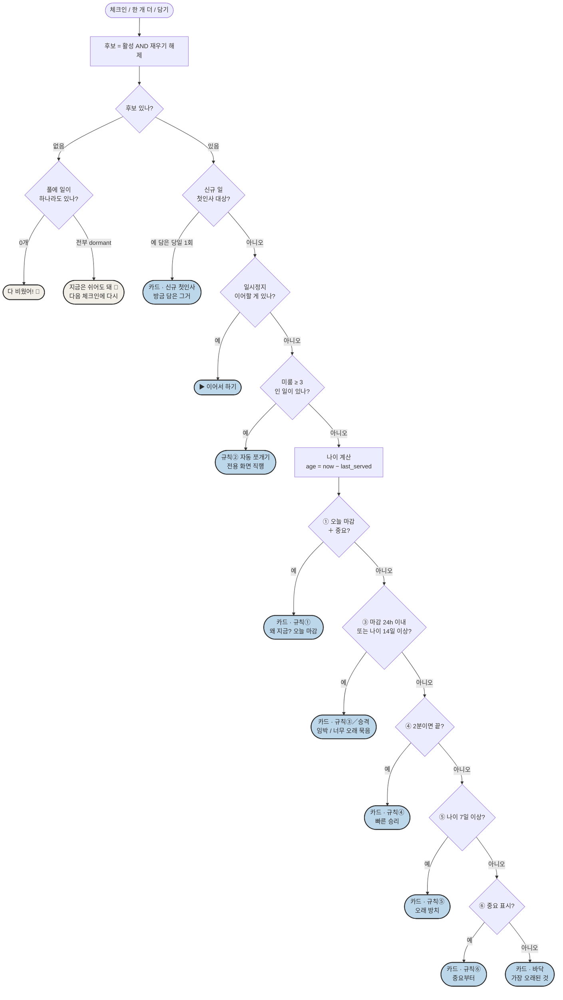
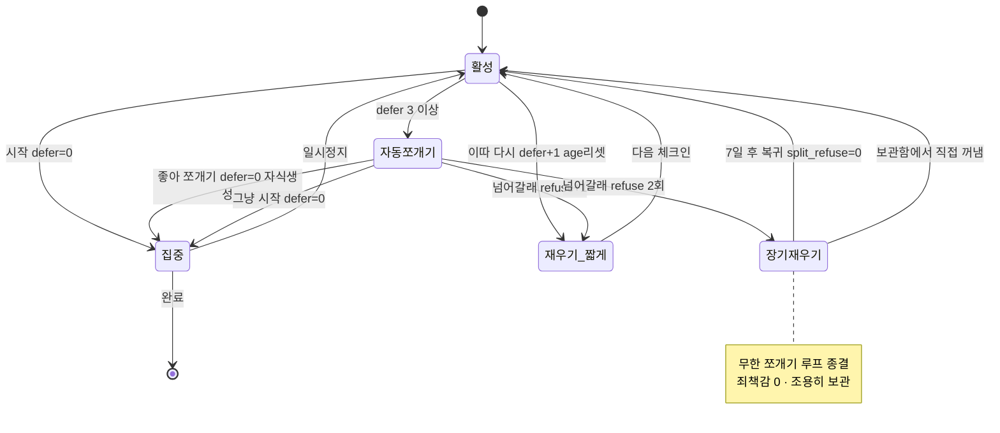
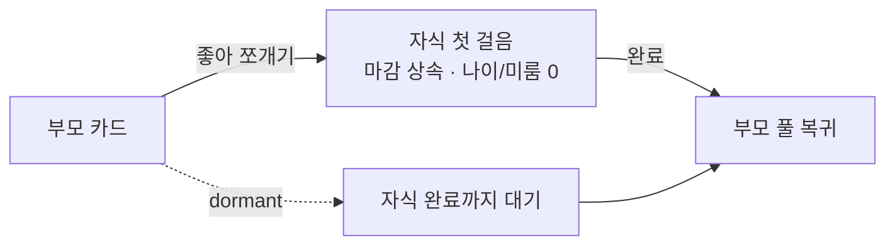

# flowmind 엔진 플로우 그래프

> 출처: docs/plan.md §4.5 카드 선택 로직 / ADR-0001 (신호 모델·O3·O4·D7~D14)
> 상태: v1.3 확정. 상수 시드값은 도그푸딩으로 튜닝(plan §4.5 표).

## ① 카드 선택 흐름 (pickNextCard)

> 같은 티어에 여럿이면 정렬: **나이↓ → 중요 표시 → created_at(먼저 만든 것)**. 바닥 티어가 항상 매칭이라 **엔진은 빈손이 안 됨**(불변식 ⒜). 결정 재현성을 위해 created_at으로 동률을 고정.

## ② 미룸 / 재우기 상태 머신 (O4 · D8)

## ③ 쪼개기 부모/자식 (D10)

